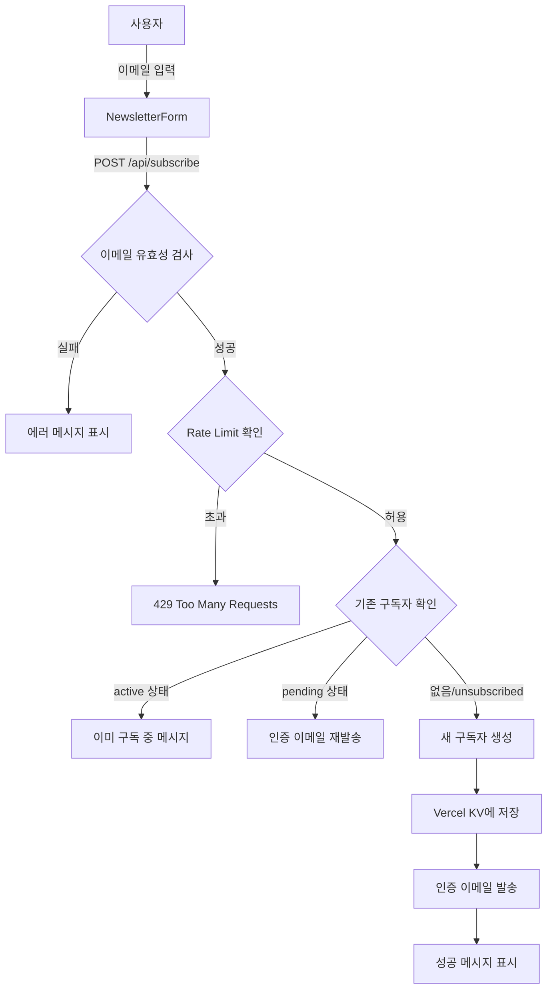
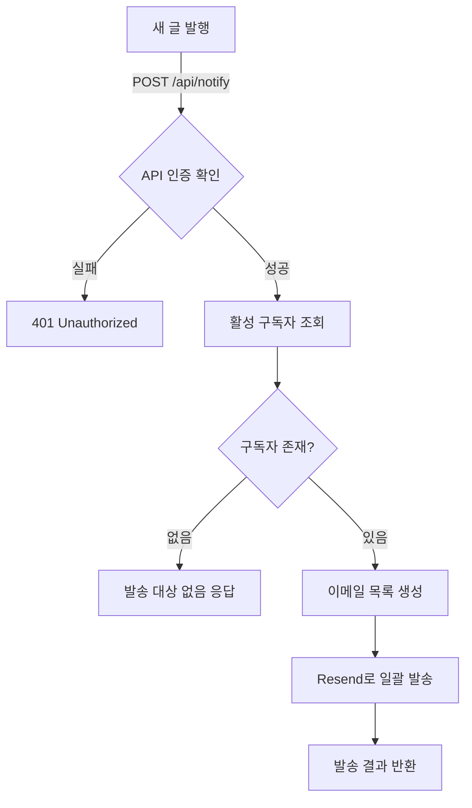
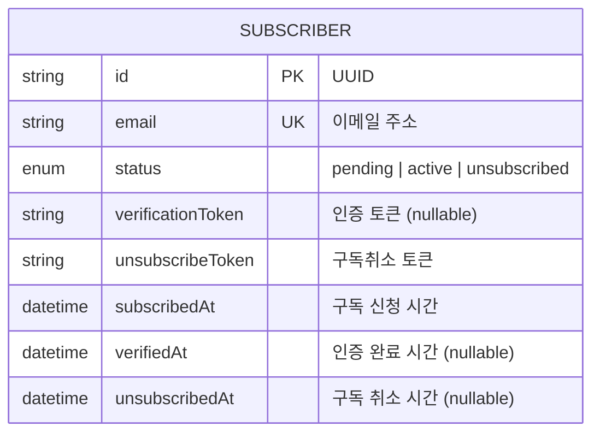
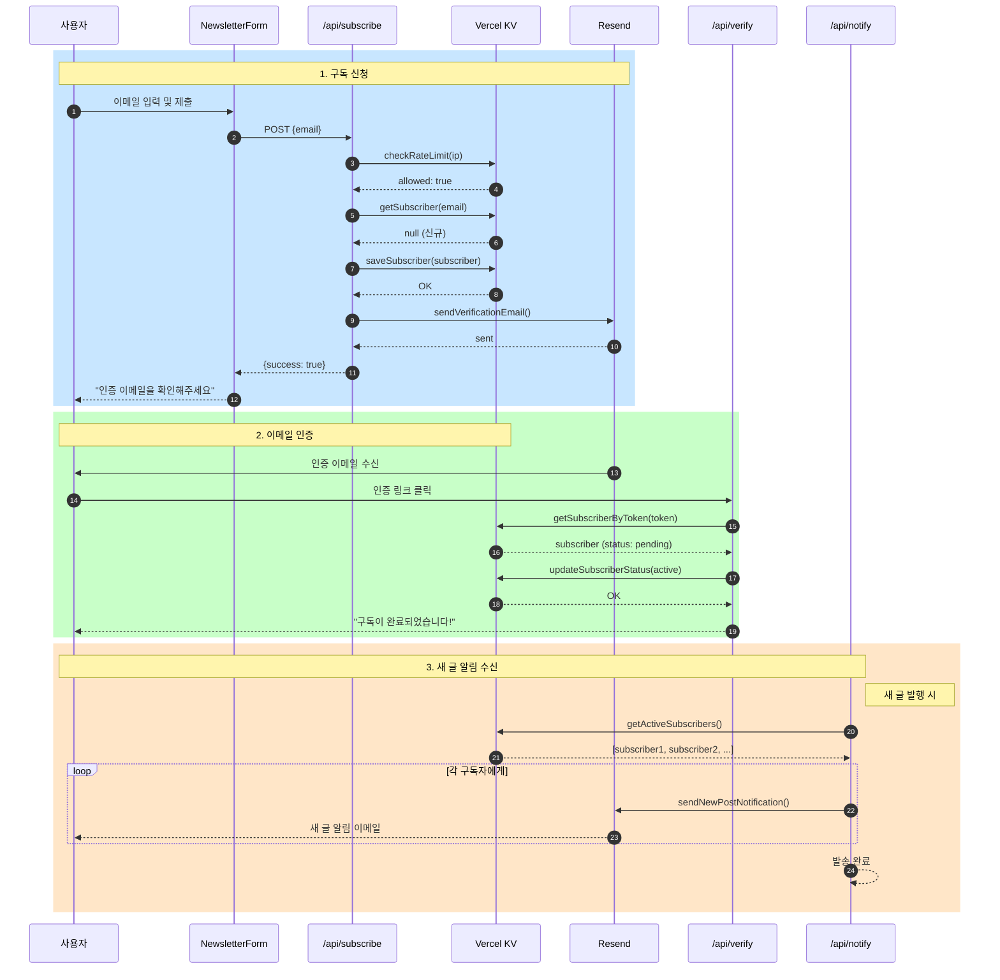

# 이메일 구독 시스템 아키텍처

## 1. 시스템 구성도

```
┌─────────────────────────────────────────────────────────────────────────────┐
│                              CLIENT LAYER                                    │
│  ┌─────────────────────────────────────────────────────────────────────┐   │
│  │                         Next.js Frontend                             │   │
│  │  ┌─────────────────┐  ┌─────────────────┐  ┌─────────────────────┐  │   │
│  │  │ NewsletterForm  │  │   /verify page  │  │  /unsubscribe page  │  │   │
│  │  │   (구독 폼)     │  │   (인증 완료)   │  │    (구독 취소)      │  │   │
│  │  └────────┬────────┘  └────────┬────────┘  └──────────┬──────────┘  │   │
│  └───────────┼────────────────────┼──────────────────────┼─────────────┘   │
└──────────────┼────────────────────┼──────────────────────┼─────────────────┘
               │                    │                      │
               ▼                    ▼                      ▼
┌─────────────────────────────────────────────────────────────────────────────┐
│                              API LAYER                                       │
│  ┌─────────────────────────────────────────────────────────────────────┐   │
│  │                      Next.js API Routes                              │   │
│  │  ┌──────────────┐ ┌──────────────┐ ┌────────────────┐ ┌───────────┐ │   │
│  │  │ /api/subscribe│ │ /api/verify │ │/api/unsubscribe│ │/api/notify│ │   │
│  │  │   POST       │ │   GET       │ │     GET        │ │   POST    │ │   │
│  │  └──────┬───────┘ └──────┬──────┘ └───────┬────────┘ └─────┬─────┘ │   │
│  └─────────┼────────────────┼────────────────┼────────────────┼───────┘   │
└────────────┼────────────────┼────────────────┼────────────────┼───────────┘
             │                │                │                │
             ▼                ▼                ▼                ▼
┌─────────────────────────────────────────────────────────────────────────────┐
│                           SERVICE LAYER                                      │
│  ┌────────────────────────────────┐  ┌────────────────────────────────┐    │
│  │      subscription.ts           │  │         email.ts               │    │
│  │  ┌────────────────────────┐   │  │  ┌────────────────────────┐   │    │
│  │  │ • saveSubscriber()     │   │  │  │ • sendVerificationEmail│   │    │
│  │  │ • getSubscriber()      │   │  │  │ • sendNewPostNotification│  │    │
│  │  │ • updateSubscriberStatus│  │  │  │ • escapeHtml()         │   │    │
│  │  │ • getActiveSubscribers()│  │  │  └────────────────────────┘   │    │
│  │  │ • checkRateLimit()     │   │  │                                │    │
│  │  └────────────────────────┘   │  │                                │    │
│  └───────────────┬────────────────┘  └───────────────┬────────────────┘    │
└──────────────────┼───────────────────────────────────┼─────────────────────┘
                   │                                   │
                   ▼                                   ▼
┌─────────────────────────────────────────────────────────────────────────────┐
│                         EXTERNAL SERVICES                                    │
│  ┌────────────────────────────┐      ┌────────────────────────────┐        │
│  │        Vercel KV           │      │          Resend            │        │
│  │        (Redis)             │      │     (Email Service)        │        │
│  │  ┌──────────────────────┐ │      │  ┌──────────────────────┐  │        │
│  │  │ subscriber:{email}   │ │      │  │ • 인증 이메일 발송   │  │        │
│  │  │ subscribers:all      │ │      │  │ • 알림 이메일 발송   │  │        │
│  │  │ ratelimit:{ip}       │ │      │  └──────────────────────┘  │        │
│  │  └──────────────────────┘ │      │                            │        │
│  └────────────────────────────┘      └────────────────────────────┘        │
└─────────────────────────────────────────────────────────────────────────────┘
```

---

## 2. 사용자 플로우 다이어그램

### 2.1 구독 플로우



### 2.2 인증 플로우

```mermaid
flowchart TD
    A[이메일 인증 링크 클릭] -->|GET /api/verify?token=xxx| B{토큰 검증}
    B -->|유효하지 않음| C[/verify 페이지 - 실패]
    B -->|유효| D{구독자 상태 확인}
    D -->|이미 active| E[이미 인증됨 메시지]
    D -->|pending| F[상태를 active로 변경]
    F --> G[verifiedAt 타임스탬프 기록]
    G --> H[/verify 페이지 - 성공]
```

### 2.3 구독 취소 플로우

```mermaid
flowchart TD
    A[구독 취소 링크 클릭] -->|GET /api/unsubscribe?token=xxx| B{토큰 검증}
    B -->|유효하지 않음| C[/unsubscribe 페이지 - 실패]
    B -->|유효| D{구독자 상태 확인}
    D -->|이미 unsubscribed| E[이미 취소됨 메시지]
    D -->|active| F[상태를 unsubscribed로 변경]
    F --> G[unsubscribedAt 타임스탬프 기록]
    G --> H[/unsubscribe 페이지 - 성공]
```

### 2.4 알림 발송 플로우



---

## 3. 데이터 모델

### 3.1 Subscriber 엔티티



### 3.2 Redis 키 구조

```
┌─────────────────────────────────────────────────────────────────┐
│                    Vercel KV (Redis) 키 구조                     │
├─────────────────────────────────────────────────────────────────┤
│                                                                  │
│  subscriber:{email}                                              │
│  ├── Type: Hash (JSON Object)                                   │
│  ├── TTL: None (영구 저장)                                       │
│  └── Value: Subscriber 객체                                     │
│      {                                                          │
│        "id": "uuid",                                            │
│        "email": "user@example.com",                             │
│        "status": "active",                                      │
│        "verificationToken": null,                               │
│        "unsubscribeToken": "uuid",                              │
│        "subscribedAt": "2024-12-24T...",                        │
│        "verifiedAt": "2024-12-24T...",                          │
│        "unsubscribedAt": null                                   │
│      }                                                          │
│                                                                  │
│  subscribers:all                                                 │
│  ├── Type: Set                                                  │
│  ├── TTL: None (영구 저장)                                       │
│  └── Members: 모든 구독자 이메일 목록                             │
│      ["user1@example.com", "user2@example.com", ...]            │
│                                                                  │
│  ratelimit:{ip}                                                  │
│  ├── Type: String (Counter)                                     │
│  ├── TTL: 300초 (5분)                                           │
│  └── Value: 요청 횟수 (max: 3)                                   │
│                                                                  │
└─────────────────────────────────────────────────────────────────┘
```

---

## 4. 시퀀스 다이어그램

### 4.1 전체 구독 라이프사이클



---

## 5. 보안 아키텍처

```
┌─────────────────────────────────────────────────────────────────┐
│                        보안 계층 구조                            │
├─────────────────────────────────────────────────────────────────┤
│                                                                  │
│  [1] 입력 검증 계층                                              │
│  ├── Zod 스키마 검증 (이메일 형식)                               │
│  ├── XSS 방지 (escapeHtml 함수)                                 │
│  └── 입력 길이 제한                                             │
│                                                                  │
│  [2] 접근 제어 계층                                              │
│  ├── Rate Limiting (IP당 5분에 3회)                             │
│  ├── API 인증 (NOTIFY_API_SECRET)                               │
│  └── 토큰 기반 인증 (UUID v4)                                   │
│                                                                  │
│  [3] 데이터 보호 계층                                            │
│  ├── HTTPS 강제 (Vercel 기본)                                   │
│  ├── 환경 변수 분리                                             │
│  └── Lazy API Key Loading (빌드 시 노출 방지)                   │
│                                                                  │
│  [4] 이메일 보안 계층                                            │
│  ├── Double Opt-in (이메일 인증 필수)                           │
│  ├── 구독취소 토큰 분리 관리                                    │
│  └── SPF/DKIM 인증 (Resend 자동)                                │
│                                                                  │
└─────────────────────────────────────────────────────────────────┘
```

---

## 6. 파일 구조

```
app/
├── lib/
│   ├── subscription.ts      # 구독자 관리 서비스
│   │   ├── Subscriber (type)
│   │   ├── generateToken()
│   │   ├── isValidEmail()
│   │   ├── saveSubscriber()
│   │   ├── getSubscriber()
│   │   ├── getSubscriberByToken()
│   │   ├── updateSubscriberStatus()
│   │   ├── getActiveSubscribers()
│   │   └── checkRateLimit()
│   │
│   └── email.ts             # 이메일 발송 서비스
│       ├── escapeHtml()
│       ├── getResendClient()
│       ├── sendVerificationEmail()
│       └── sendNewPostNotification()
│
├── api/
│   ├── subscribe/route.ts   # POST: 구독 신청
│   ├── verify/route.ts      # GET: 이메일 인증
│   ├── unsubscribe/route.ts # GET: 구독 취소
│   └── notify/route.ts      # POST: 알림 발송 (인증 필요)
│
├── components/
│   └── newsletter-form.tsx  # 구독 폼 UI 컴포넌트
│
├── verify/
│   └── page.tsx             # 인증 결과 페이지
│
└── unsubscribe/
    └── page.tsx             # 구독 취소 결과 페이지
```

---

## 7. 환경 변수

| 변수명 | 필수 | 설명 |
|--------|------|------|
| `RESEND_API_KEY` | ✅ | Resend API 키 |
| `FROM_EMAIL` | ❌ | 발신 이메일 (기본: onboarding@resend.dev) |
| `NEXT_PUBLIC_SITE_URL` | ❌ | 사이트 URL (기본: http://localhost:3000) |
| `NEXT_PUBLIC_SITE_NAME` | ❌ | 사이트 이름 (기본: My Blog) |
| `NOTIFY_API_SECRET` | ✅ | 알림 API 인증 키 |
| `KV_*` | ✅ | Vercel KV 연결 정보 (자동 설정) |
